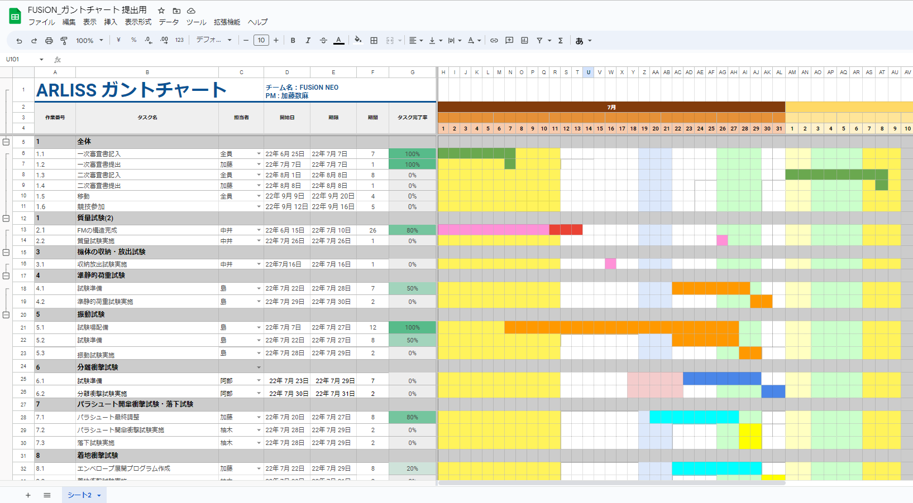

# 審査書の書き方について
審査書とは、競技に参加する上で必要な書類であり、記入する項目としては

- ミッションステートメント
- サクセスクライテリア
- 要求項目の設定
- システム仕様
- 試験項目の設定
- 実施試験の内容
- 工程管理、ガントチャート

の6つの内容について書きます。

### ミッションステートメント
ミッションステートメントとはCanSatを用いた競技でのミッションの内容を設定します。
### サクセスクライテリア
サクセスクライテリアとはミッションステートメントで書いたミッションのミニマムサクセス、ミドルサクセス、フルサクセスの3つの項目を設定します。
#### ミニマムサクセス
ミッションステートメントで設定したミッションで最低限達成したい項目
例) 0mゴールを達成する
#### ミドルサクセス
ミッションステートメントで設定したミッションでミニマムサクセスの次に達成したい項目
例) 画像をSDカードに保存する
#### フルサクセス
ミッションステートメントで設定したミッションの内容
例) SDカードで保存した画像を用いて3Dモデルを生成する
### 要求項目の設定
システム要求とミッション要求の2つがあり、システム要求とはARLISS打ち上げの安全基準の項目、ミッション要求はミッションステートメントで設定したミッションを達成するために必要な項目があります。
例) 

表1.2022年度ARLISSの安全基準

|要求番号|システム要求|
|:-:|:-:|
|S1|投下する機体の質量が基準を満たしている|
|S2|容積がキャリア基準を満たしている|
|S3|打ち上げ時の準静的荷重によって，安全基準を充足するための機能が損なわれていないことが試験で確認できている|
|S4|打ち上げ時の振動荷重によって，安全基準を充足するための機能が損なわれていないことが試験で確認できている|
|S5|ロケット分離時の衝撃荷重によって，安全基準を充足するための機能が損なわれていないことが試験で確認できている|
|S6|パラシュート開傘時の衝撃荷重によって，安全基準を充足するための機能が損なわれていないことが試験で確認できている|
|S7|地表近くで危険な速度で落下させないための減速機構を有し，その性能が試験で確認できている|
|S8|ロストへの対策を実施しており，有効性が試験で確認できている（対策例：位置情報送信，ビーコン，蛍光カラーペイント等）|
|S9|打ち上げ時の無線機の電源OFFの規定を遵守できることが確認できている （FCC認証かつ100mW以下の機器はOFFしなくて良い．また，スマートフォンを用いる場合はFCC認証かつソフトウェアまたはハードウェアスウィッチでoffにできること）|
|S10|無線のチャンネル調整に応じる意思があり，また実際に調整ができることを確認できている|
|S11|ローバーと地上局の通信可能距離が5km以上である|
|S12|ロケットへの装填からミッションの開始，打ち上げ後の回収までを模擬したEnd-to-end試験を実施できており，今後，大幅な設計変更はない|
|M1|キャリアから放出時にローバーからの信号を地上局で受信できる|
|M2|ゴールの付近を周回しながら，画像を2枚以上取得できるSDカードに保存できる|
|M3|地上局で地形の3Dモデルを生成できる|
|M4|走破性を持ち，またスタックしても脱出することが確認されている|
|M5|ミッション時に人間が介在しない自律制御を実施することを確認出来ている|
|M5-1|着地後，エンベロープが展開できることを確認できる|
|M5-2|GPSと9軸センサ―を用いてゴール付近5mまで接近できる|
|M5-3|カメラを用いたゴール認識により，ゴール5m付近から0mゴールを達成できる|
|M6|ミッション後，規定された制御履歴レポートを運営及び審査員へ提出しログ・取得したデータについて説明が可能な状態である|
### システム仕様
システム仕様では、製作した機体の外観、内観・機構について書きます。
- 外観
  - 機体の外観や質量、直径、高さを書きます。
- 内観機構
  - 内観機構では以下の項目ついて書きます
    - 機体構造
    - 駆動構造
    - 電装系
    - 制御系
### 試験項目の設定
要求項目で設定した項目をクリアしているか確認するための試験を設定します。
例) 

表2.2022年度の試験項目

|番号|検証項目名|対応する自己審査項目の要求番号（複数可）|
|:-:|:-:|:-:|
|V1|質量試験|S1|
|V2|機体の収納・放出試験|S2|
|V3|準静的荷重試験|S3|
|V4|振動試験|S4|
|V5|分離衝撃試験|S5|
|V6|パラシュート開傘衝撃試験|S6|
|V7|落下試験|S7| 
|V8|着地衝撃試験|S7，M5-1|
|V9|GPSデータダウンリンク試験|S8|
|V10|通信開始試験|S9， M1|
|V11|長距離通信試験|S8，S10，S11|
|V12|End-to-end試験|S12|
|V13|3Dモデル生成試験|M4|
|V14|カメラを用いた0mゴール試験|M2，M5-3|
|V15|制御履歴レポート作成試験|M6|
|V16|GPS走行試験|M5-2|
|V17|スタック試験|M7|
|V18|画像取得及び保存試験|M2|
### 実施試験の内容
試験項目で設定した項目の実施した試験の内容について書きます。
### 工程管理、ガントチャート
機体開発の工程や試験の実施日などについてスプレッドシートに書きます。

例) 2022年度のガントチャート

