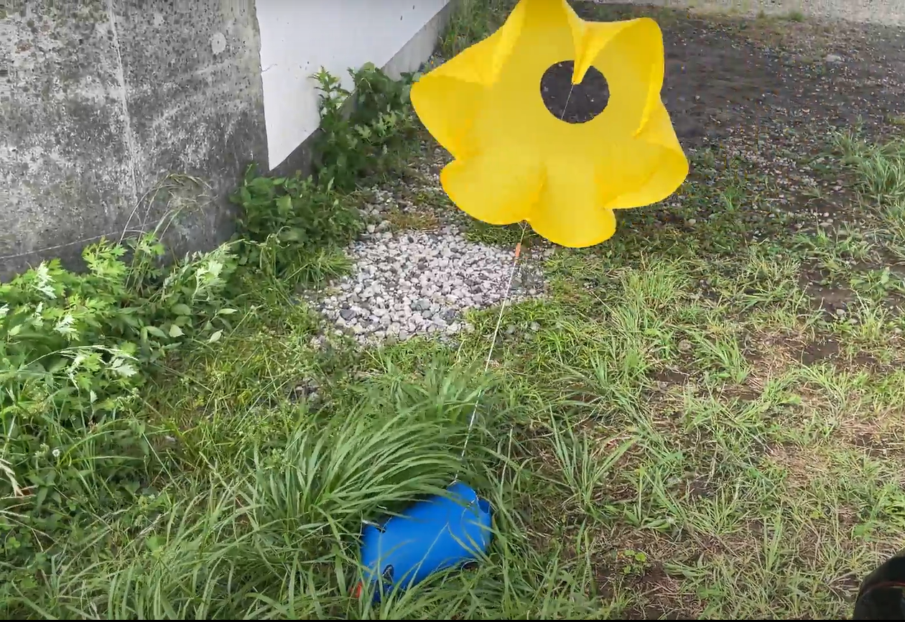
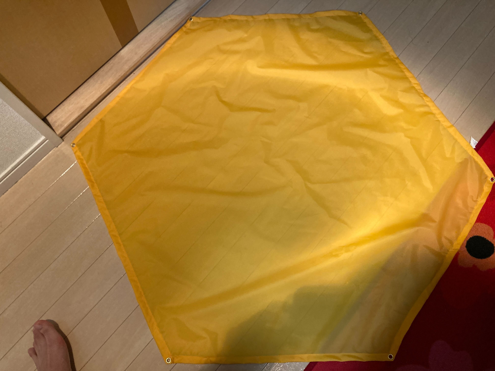
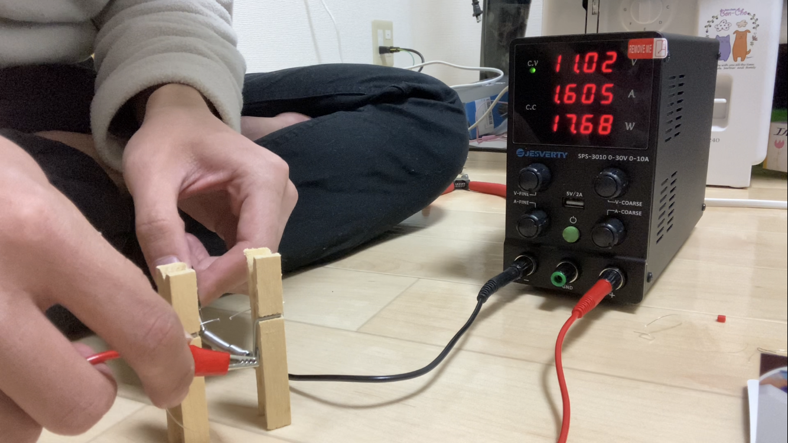
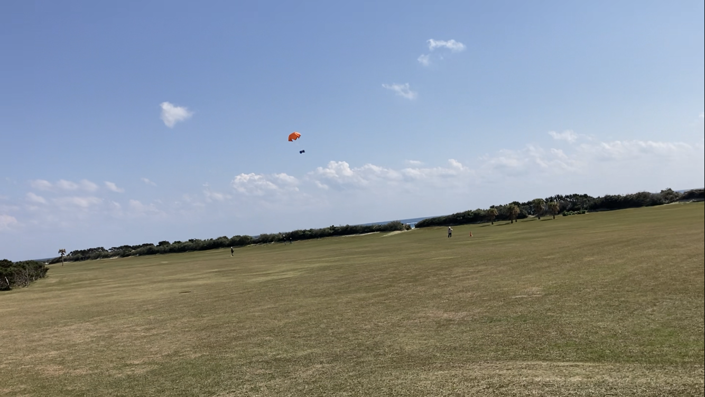

# 飛行系について
FUSiONに入って一年で合計3枚のパラシュートを作ったので多少の飛行系の経験はあるかと思い、今回こちらを描かせていただくことになりました。  
飛行系はミシンを使う必要があるのでCanSat開発の中で最も日常生活で役立つスキルになると考えています(何をもって日常生活と呼ぶのかは置いといて)。  (2023年4月塩田 記す)
## パラシュート製作
### パラシュートの材質
- キャノピー(布部分)
    - ナイロンタフタ
    - リップストップナイロン  
    過去、私はナイロンタフタを使用してきた。  
    おもに傘の材料として用いられ、引っ張りに強い。  
    また通気性がほとんど無いため、しっかりパラシュートの減速機構としての機能は果たせる利点を持つ反面、風に大きく影響される。  
    パラシュートが風にあおられないようにするためには、パラシュート中央に穴を開けることが考えられる。  
    2022年ARLISSで用いたパラシュートは以下のように穴の開いているパラシュートを作成していた。  
      
    リップストップナイロンを紹介した理由は、過去の大会で使われている事例が多いためである。  
    リップストップナイロンはアウトドア用品に用いられていて、特にテントやザック等雨風にさらされるような物の表面の記事になっている。
      
    ただし布屋では見かけたことはないのでインターネットで注文する他ないと考えられる。  
    ちなみにナイロンタフタは布屋でよく売られている。  
    参考までに、私が利用している布屋は[こちら](https://www.sankakuya.org/)である。  
    (調べて初めて知ったが福岡周辺の店だと気づいたので参考程度に…)

- パラコード(紐部分)
    - ナイロン紐 
    ナイロン紐は紐の組み方に様々な種類がある。  
    金剛打ち  
      
    8打ち    
      
    16打ち  
      
    引張強度や結びやすさ、重量等を加味して選択してほしい。  
    参考までに、私は金剛打ちの3mmのナイロン紐を使っていた。  
    理由は紐が分解することなく(8打ちや記載はしていないが3打ちなどでは紐がばらけることがあった)、結びやすさ、強度も十分だと判断できたからである。  
    [参考](https://www.taisei-mfg.co.jp/lesson.html)    

- ハトメ
    - 真鍮製  
    ハトメはパラシュートの紐を通す部分に補強のために付ける。  
    材質にこだわったことは私自身ないが、真鍮製のものを使っていた。  
    

### パラシュートのサイズ
- キャノピー
正六角形で対角線は1100mmで作成した。  
サイズは過去の大会のパラシュートを参考にした。  
　　
また、畳み方は次のホームページを参考にした。  
  
[http://joujaku-pc-club.blog.jp/archives/5920767.html](http://joujaku-pc-club.blog.jp/archives/5920767.html)
- パラコード  
紐の直径はこれまで3mmを使ってきた。  
太いと重たいが引っ張りに強い。細いと軽いが引っ張りに弱い。  
パラコードの長さは長いほど展開が遅く、パラシュートの開き幅が大きい(終端速度が遅い)。  
短いほど展開は早いが、パラシュートの開き幅が小さい。  
一般にキャノピーの対角線の半分が良いという話を聞いたことがある(ソース無し)。  
- ハトメ  
サイズは直径8mm程。紐のサイズギリギリだと結びにくかったり、整備しづらかったりする。

## エンベロープの開発
### エンベロープとは
飛行系に分類されるエンベロープとは、落下時にCanSatに巻きついており、着地後にパラシュートの展開とともに展開されるものである。  
作成する利点は
- パラシュートを機体に直接付ける必要が無い
    - 開傘時の衝撃を分散できる
    - 展開を簡単にできる
- 着地時の耐衝撃性を高める  
ことがある。  

- 材質  
前回のARLISSの時はPPクラフトシートを用いた。  
Mission3でもPPクラフトの使用を考えていたが、重量の関係でそもそもエンベロープを使えなかった。  

- 設計
機体に巻きつけるような形かつ、機体側面から落ちないように壁を付けている。 
巻きつける時に固定するのはテグスを用いていた。その理由は展開機構の説明の際に記述する。 

## 展開機構の開発
### 展開機構とは
パラシュートを開いてCanSatを落下させるわけだが、そのままひきずって走るのはあまりに非効率である。(そもそも走れないかもしれない)  
そこでパラシュートを切り離す必要がある。
### 構造説明
これまでのFUSiONでは、機体を取り巻くエンベロープにパラシュートを取り付け、エンベロープを機体から外すことで展開を行ってきた。  
エンベロープはテグスで固定されているが、テグスは熱に弱い。そのテグスを、電熱線等で用いられるニクロム線を用いて焼き切るという構造である。
  
ニクロム線は以下のようなものを4等分にして用いた。  

## 最後に
飛行系は特に教育としては伝える内容が少ないが、CanSatがそもそも走り出せるかを決めるフェーズを担当することになるので、最も重要であるといっても過言ではないだろう。  
実際、これまでのFUSiONでは、2022年の能代宇宙イベントでは、溶断こそ成功したものの、機体が裏返しに着陸して表を向くことができずにリタイア。2022年のARLISSでは、カーボン抵抗を用いて焼き切る構造を採用していたが、気流の関係で焼き切ることが出来ずにリタイア。2023年の種子島ロケットコンテストでも接続の関係でニクロム線での溶断が出来ずにパラシュートが絡まりリタイアといった経験がある。  
以下に飛行系が重要であるかをお伝え出来たところで本記事はここまでとする。  
  