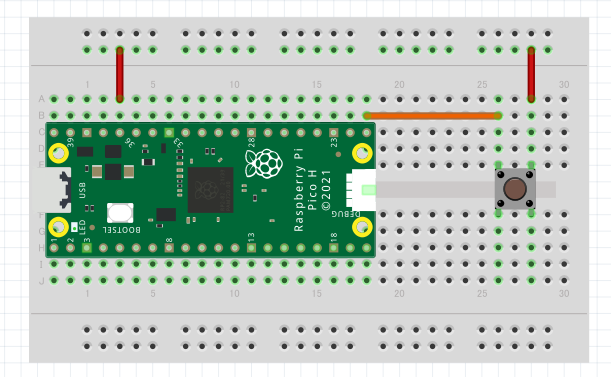
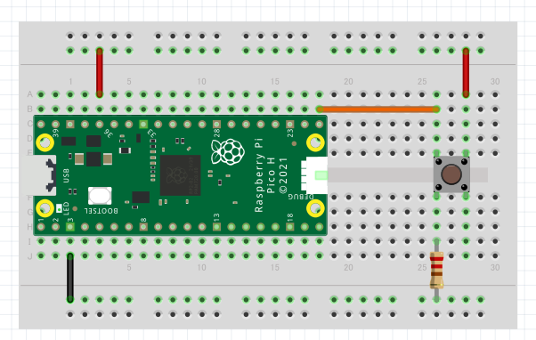

# スイッチと入力

マイコンで出力をするとき，以下のようにコードを書くことで，GPIOの電圧を**出力**できることを理解しました．
```py
gpio = Pin(16, Pin.OUT)
gpio.value(1)
```

しかし，GPIOとは(General Purporse Input Output：汎用入出力)の略です．

では，このGPIOピンを用いて入力を行うにはどうすればいいでしょうか．

## GPIOを入力として使う
上のプログラムでは`Pin(16, Pin.OUT)`というように，`OUT`と宣言している部分で出力の設定をしていそうです．この`OUT`の部分を`IN`に宣言し直してみましょう．

```py
pin = Pin(16, Pin.IN)
```
このように，コードを書き換えることができます．
これで正解です．

ただし，出力のように，こちらから`0`，`1`を指定することがないので，`gpio.value(1)`や`gpio.value(0)`のように出力を設定するコードがないので，読み取るためには別なコードを書く必要がありそうです．

ここでは，次のように書きます．
```py
val = pin.value()
print("INPUT:", val)
```

`pin.value()`でピンの電圧(HIGH/LOW, 0/1)を読み取り，変数`val`に格納しています．
そうすると，出力は次のように出てくるはずです．

また，このように，`0`と`1`の2つの状態だけで入力を定義するやり方を **「デジタル入力」** と言います．

```
INPUT: 0
INPUT: 1
INPUT: 0
INPUT: 0
INPUT: 1
…
```
実際に回路を作って体験してみましょう．

## 準備するもの
* [Raspberry Pi Pico](https://akizukidenshi.com/catalog/g/g116132/)
* [ジャンパワイヤ](https://akizukidenshi.com/catalog/g/gC-05159/)(リンクは参考)
* [ブレッドボード](https://akizukidenshi.com/catalog/g/gP-05294/)(リンクは参考)
* [タクトスイッチ](https://akizukidenshi.com/catalog/g/g103647/)
* [抵抗(10kΩ) (4.7kΩ)](https://akizukidenshi.com/catalog/g/g125103/)

## スイッチの回路
今回，インプットに電圧が加わっているかどうか，スイッチ素子を使いON/OFFを切り変えて読み取っていく回路を作ります．

スイッチの素子は，基本的に次のような見た目をしています．

これはタクトスイッチと言い，物理的な押下(タクト)によってON/OFFを切り替えるスイッチです．押している間だけONになり，離されるとOFF になるものを **「モーメンタリ方式」**，押すと次に押されるまでON/OFFが固定されるものを **「オルタネート方式」** と呼びます．

タクトスイッチの中身の電気的な回路は下の図のようになっています．
向かい合う2つの端子が常に導通しており，隣り合う2つの端子のON/OFFが切り替わります．


## 作成する回路
それでは，下のような回路を作ってみて，スイッチを押されたときに電圧を読み取れる(`INPUT:1`になるか)か試してみましょう．

もちろん，スイッチが押されていないときは`INPUT:0`になるはず......．


この回路図を実現するために，RaspberryPiPicoはブレッドボード上で以下のように接続することになります．


## 今回実行するプログラム

さて，上では一部だけ紹介したMicroPythonのGPIO読み取りプログラムですが，ここで全体を紹介します．

```py
# 各種必要なライブラリをインポート
from machine import Pin
import time

# 16番ピンを入力モードに設定
pin = Pin(16, Pin.IN)

# 0.2秒おきに入力した値を更新
while True:
    val = pin.value()
    print("INPUT:", val)
    time.sleep(0.2)
```


## デジタル入力を実行してみよう

ここで，スイッチを <u>**ONにして** </u> しばらく様子を観察してみよう．
```
INPUT: 1
INPUT: 1
INPUT: 1
…
```
このようになっていたら，成功です！
回路もうまく繋ぐことができていると思います．

では，今度はスイッチを <u>**OFFにして** </u> しばらく様子を観察してみよう．
もしかしたら，次のようになるかもしれません．
```
INPUT: 0
INPUT: 1
INPUT: 0
INPUT: 0
INPUT: 1
…
```
おや...おやおやおや.........？

この原因を次の章で考察していきましょう．

## プルダウンによる入力信号の安定

先ほどの回路をもう一度，見直してみましょう．
<u>スイッチがOFFになっているとき</u>，奇妙な回路になっていることが気づいたでしょうか．

図のように，<u>**マイコンとスイッチまでの間の回路の部分が電源にもGNDにも接続されておらず，電位不定となっているのです．**</u>

このような状態では，マイコン内部の周辺回路のノイズ等により，電圧を読み取るGPIOの電圧が**閾値 (しきい値：0と1を判断するボーダーライン) の付近で不安定な状態となり**，正確な測定が出来なくなります．

ここで，実際の回路では次のような接続を行います．


これにより，
* スイッチがONの時は電源電圧
* スイッチがOFFの時はGND電圧(0V)

が実現できます．
ここで，マイコンの端子をGND電位に安定させるために接続している抵抗を<u>**「プルダウン抵抗」**</u>と呼びます．

GPIOの電位について，抵抗の電流に依存した電圧降下特性 $V=RI$によりスイッチがONの時は電源電圧，スイッチOFFの時は$0A$なので抵抗両端の電圧降下$0V$によりGND電位に揃えることが出来るのです．

## プルダウンしてリトライ

上で示された回路図を参考に，プルダウン抵抗を導入して再度入力電圧を読み取りましょう．

ここに，プルダウン抵抗を導入した回路図を示します．


スイッチをONにしたときに`INPUT: 1`，OFFにしたときに`INPUT:0`となれば成功です．

## プルアップとプルダウンのおさらい

今回はプルダウン方式について説明しましたが，普段の日常製品ではスイッチがONの時に0になる<u>**プルアップ方式**</u>が多く採用されています．(なぜプルアップの方がよく使われるのか？調べてみましょう)


プルアップ方式の回路でも，信号入力が出来るかを試してみましょう．

また，最近のマイコンはプルアップ抵抗・プルダウン抵抗をチップ内に内蔵し，コードを書くだけで回路の中でプルアップしてくれたりもします．
回路の省スペース化や回路作成ミスの削減に繋がるので，積極的に使ってみましょう．

この内蔵プルアップ・プルダウンはRaspberryPiPicoではデフォルトでは無効化されていますが，次のように記述することで有効化することが出来ます．

```py
# 内蔵プルアップ無効(デフォルト)
pin = Pin(13, Pin.IN)
```
```py
# 内蔵プルアップ有効
pin = Pin(13, Pin.IN, Pin.PULL_DOWN)
```


## 作業時の注意

ブレッドボードを用いて作業する時の注意点は以下の通りです。

* 配線中はブレッドボードの足や部品の足が他のピン等に触れないように注意する。(ブリッジしてショートすると悲惨)
* MOSFETのような部品は向きを間違えないように注意して配線する。(向きのある部品を逆接すると発火・爆発の恐れあり)

## 課題

1. この講座で扱ったプルダウン方式のインプット回路を，内蔵プルダウンを有効にしてプルダウン抵抗を取り外して実現してみましょう．
2. プルダウン回路だけでなくプルアップ回路を作り，スイッチのON/OFFを読み取ってみましょう．(理解のために内蔵プルアップを無効化してやってみましょう)
3. 世の中ではなぜプルアップ方式の方がよく使われているか考えてみましょう．
4. マイコンを2つ用意し，片方のマイコンで1秒ごとにHIGH/LOWを出力し，もう片方のマイコンで1秒ごとに0/1を読み取り`print`するプログラムを作成して動かしてみましょう．(第1回講座の応用)
5. 4の課題と同じ回路で，出力周期を1秒にしたまま入力周期を0.1秒にしてプログラムを実行しましょう．また,
それが出来たら出力周期を0.1秒，入力周期を1秒に戻してプログラムを実行してみましょう．


## 参考

* <https://ameblo.jp/nakamine164/entry-12488736655.html>
* <https://voltechno.com/blog/pullup-pulldown/>
