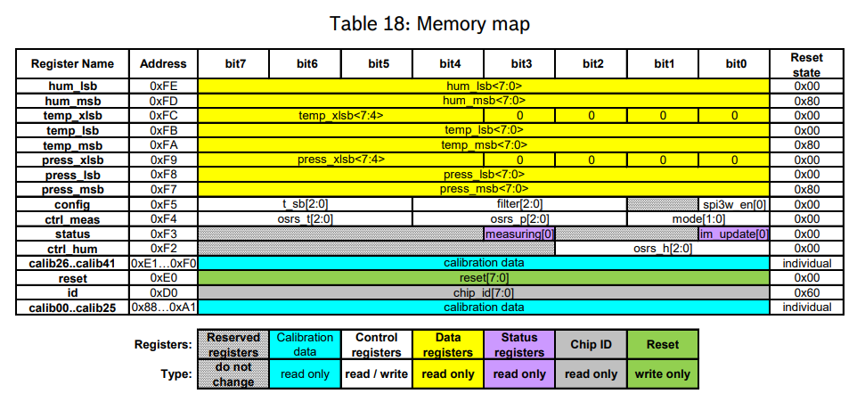
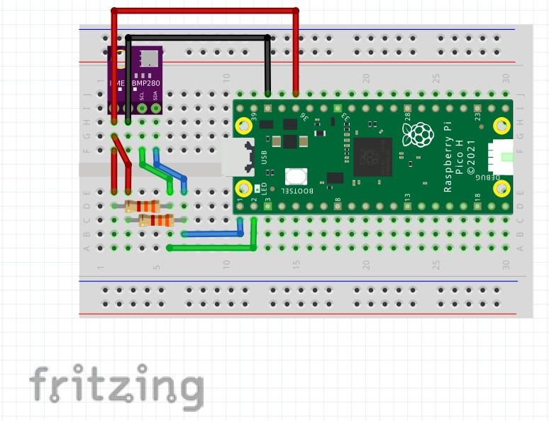

# センサを使ってみよう

## 準備するもの

* [Raspberry Pi Pico](https://akizukidenshi.com/catalog/g/g116132/)
* [ジャンパワイヤ](https://akizukidenshi.com/catalog/g/gC-15869/)
* [ブレッドボード](https://akizukidenshi.com/catalog/g/gP-05294/)
* [抵抗(3.3kΩ)](https://akizukidenshi.com/catalog/g/gR-25332/)
* [温湿度・気圧センサ](https://akizukidenshi.com/catalog/g/gK-09421/)
* PCとマイコンをつなぐケーブル

# センサを使ってみよう

前章の [02\_センサの信号.md](./02_センサの信号.md)で扱ったことを、実際にセンサを利用することで体験してみましょう。
今回は、温湿度・気圧センサとして [BME280](https://www.mouser.com/datasheet/2/783/BST-BME280-DS002-1509607.pdf) を利用します。


実際のチップ単体は画像のように端子が露出しておらず扱いにくいため、秋月電子などで[モジュール化されたもの](https://akizukidenshi.com/catalog/g/g109421/)を用います。電子工作では、このようにモジュール品を利用することが一般的です。


## 1. ドライバとは何か？

電気回路やセンサから直接データを読み取るのは、初心者には少し難しい。そこで登場するのが **ドライバ（Driver）**と呼ばれるプログラムです。ドライバは、センサの「取り扱い説明書」の役割を果たし、難しいレジスタ設定やバイナリ演算を隠してくれる仲介者のようなものと考えてください。
今回は、こちらでCanSat_FUSiON製[BME280ドライバ](./00-サンプルコード/03-sensor/bme280_simple.py)を作成し用意しました。


### 1.1 ドライバを使わないとどうなる？

* センサを使うには「レジスタ」と呼ぶ小さな住所に直接指示を書き込む必要があります。
  例：リセットはレジスタ `0xE0` に値 `0xB6` を書き込む。
* 生データはバイト列で返ってくるため、自分でビット演算して温度・湿度・気圧に変換しなくてはならない。

これらを一つずつ手作業で行うと、書き間違いや順序ミスでエラーが頻発し、初心者には大きなハードルとなります。



ここの画像で示すのが，BME280のメモリマップです．

### 1.2 ドライバが自動でやってくれること

| 手動で行う処理例                            | ドライバでの呼び出し例                                                |
| ----------------------------------- | ---------------------------------------------------------- |
| リセット (`0xE0` に `0xB6` 書き込み)         | `bme.reset()`                                              |
| 動作モード設定 (`0xF2`,`0xF4`,`0xF5` 書き込み) | `bme.init()`                                               |
| 生データの読み出し・ビット演算                     | `temp_raw, pres_raw, hum_raw = bme.read_raw()`             |
| キャリブレーション補正計算                       | `temperature, pressure, humidity = bme.read_compensated()` |


### 1.3 BME280 のレジスタマップ（具体例）

* **0xE0 (reset)**：センサを工場出荷時の状態に戻すリセット命令
* **0x88–0xA1, 0xE1–0xE7**：キャリブレーションパラメータをまとめて読み出す
* **0xF2 (ctrl\_hum)**：湿度オーバーサンプリング設定
* **0xF4 (ctrl\_meas)**：温度・圧力オーバーサンプリング＋動作モード設定
* **0xF5 (config)**：フィルタ設定とスタンバイ時間設定
* **0xF7–0xFE**：測定済みの生データ（温度20bit、圧力20bit、湿度16bit）を一括取得

これらの複雑な手順を、[`bme280_simple.py`](./00-サンプルコード/03-sensor/bme280_simple.py) に用意されたメソッドを呼び出すだけで実行できるのがドライバの便利な点です。

---

## 2. ドライバファイルの保存方法

### 2.1 Thonny を使う方法

1. Thonny を起動し、右下のインタープリタを **MicroPython (Raspberry Pi Pico)** に切り替えます。
2. ドライバコード([`bme280_simple.py`](./00-サンプルコード/03-sensor/bme280_simple.py))を貼り付け、**名前を付けて保存 → Raspberry Pi Pico → bme280\_simple.py**。
3. 同様に `main.py` を Pico 上に保存する。

> Raspberry Pi Picoは，"`main.py`"として保存されたファイルだけは電源投入時に自動実行されます。

### 2.2 mpremote／ampy を使う方法

**なぜ必要か？**
ターミナルから直接 Pico のファイルシステムへファイルを転送するために使用します。GUI に頼らずスクリプトやCI環境からも簡単に配置できます。

```bash
# mpremote の場合（推奨）
mpremote connect /dev/ttyACM0 fs cp bme280_simple.py :
mpremote connect /dev/ttyACM0 fs cp main.py :

# ampy の場合
ampy --port /dev/ttyACM0 put bme280_simple.py
ampy --port /dev/ttyACM0 put main.py
```

配置後、REPL で `import os; print(os.listdir())` を実行し、両ファイルが表示されれば成功。


## 作成する回路

今回はBME280を用いてI2Cによる通信を体験します。
UARTの方がノイズが乗りにくい等のメリットがありますが、一つのポートに複数の機器を接続できるなどのメリットもあり電子工作でも多く使われています。
RaspberryPiではUARTのポートが一口しかないのも使いづらい原因ですが、UARTを増やしたいときはスレーブとしてマイコンを増やしてI2Cに変換するなどの対応が可能です。



例によって今回使う部品と若干違うデータを使ってしまっているので、データシート等を見ながらピンアサインをうまいこと見比べて配線してください。
※FUSiONの新人研修ではzoomでお話します。

## 作業時の注意

ブレッドボードを用いて作業する時の注意点は以下の通りです。

* 配線中はブレッドボードの足や部品の足が他のピン等に触れないように注意する。(ブリッジしてショートすると悲惨)
* センサに低格以上の電流が流れる/電圧が印加されると容易に破壊されるため、センサを使用する際はVccピンに定格以上の電圧を加えないように注意する。

## 使用するプログラム

```python
# main.py
import time
from machine import I2C, Pin
from bme280_simple import BME280Simple

i2c = I2C(0, sda=Pin(0), scl=Pin(1), freq=100000)
bme  = BME280Simple(i2c)

while True:
    temp, pres, hum = bme.read_compensated()
    print(f"Temp: {temp:.2f} °C, Pres: {pres:.2f} hPa, Hum: {hum:.2f} %")
    time.sleep(1)
```


## 作業時の注意

ブレッドボードを用いて作業する時の注意点は以下の通りです。

* 配線中はブレッドボードの足や部品の足が他のピン等に触れないように注意する。(ブリッジしてショートすると悲惨)
* センサに低格以上の電流が流れる/電圧が印加されると容易に破壊されるため、センサを使用する際はVccピンに定格以上の電圧を加えないように注意する。

## 4. 起こりうるエラーと診断方法

### ソフトウェアレベルのエラー

| エラー例                                           | 原因               | 診断方法                                   |
| ---------------------------------------------- | ---------------- | -------------------------------------- |
| `ImportError: no module named 'bme280_simple'` | ファイル未配置          | `os.listdir()` で一覧を確認、再転送              |
| `OSError: [Errno 5] EIO`                       | I²C 通信失敗         | `i2c.scan()` でアドレス確認 (0x76/0x77)、配線再確認 |
| `ValueError: too many values to unpack`        | 戻り値数と受け取り変数数の不一致 | `read_compensated()` 定義と呼び出し側を照合       |

### ハードウェアレベルのエラー

| 症状             | 原因                   | 診断方法                    |
| -------------- | -------------------- | ----------------------- |
| 常に 0 または異常値が返る | SDA/SCL、VCC/GND 配線ミス | 配線図と実物を突き合わせ、ピン再接続      |
| 通信途絶・再起動ループ    | 電源電圧不足、プルアップ抵抗未実装    | 3.3V 電源安定度確認、4.7kΩ 抵抗追加 |

---


## 課題

1. **1秒間隔で値を取得**
   `main.py` の最後の `time.sleep(1)` を変更し、2秒間隔で測定するよう動作を確認せよ。

2. **温度のみを表示**
   `bme.read_compensated()` の戻り値から温度だけを取り出し、

   ```python
   temp = bme.read_compensated()[0]
   ```

   を使って温度だけをコンソールに表示するプログラムを作成せよ。

3. **LED 点灯制御**
   温度が30 ℃以上になったら Pico の GPIO ピン（たとえば GP2）に接続した LED を点灯させる制御を追加せよ。

   * データシート p.26 の「GPIO」表を参照し、GPIO 出力の方法を確認する。

4. **スタンバイ時間の変更と測定速度の確認**
   データシート p.30 の「Standby time」項目を読み、スタンバイ時間は何を表すかを読み取れ。また、スタンバイ時間を 125 ms に設定するにはレジスタ `0xF5 (config)` のどのビットを変更すればよいかを考え、[`bme280_simple.py`](./00-サンプルコード/03-sensor/bme280_simple.py) の初期化部分を書き換えて実行環境を作成せよ。

   * 実行後、シリアルモニタで測定間隔が約125 msになることを確認せよ。

5. **IIR フィルタの設定とデータの安定性観察**
   データシート p.30 の「Filter」仕様を読んで、IIR フィルタはどのような役割を果たすかを求めよ。また、IIRフィルタを「×4」に設定する方法を調べ、[`bme280_simple.py`](./00-サンプルコード/03-sensor/bme280_simple.py) の `config` レジスタ設定を変更せよ。

   * 取得した湿度データを 10 回連続でコンソールに出力し、ノイズの変化（値のばらつき）が小さくなるかを観察せよ。


## 参考
* [BME280データシート](https://www.bosch-sensortec.com/media/boschsensortec/downloads/datasheets/bst-bme280-ds002.pdf)
* https://www.itmedia.co.jp/news/articles/2107/23/news022_2.html