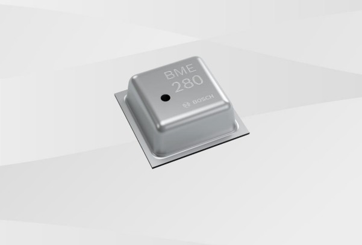
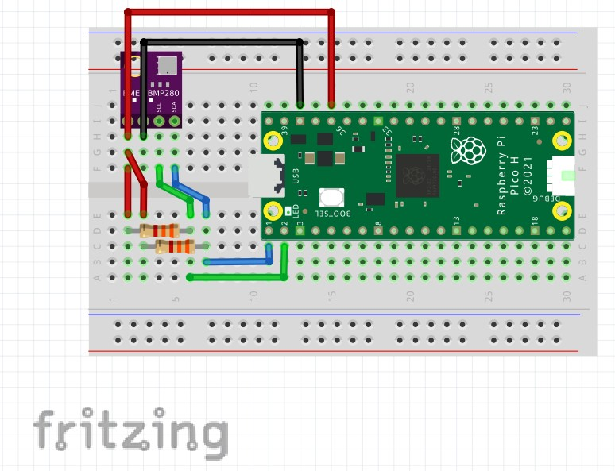

# センサを使ってみよう

前章の [02_センサの信号.md](./02_センサの信号.md)で扱ったことを実際にセンサを利用することで体験してみましょう。  
今回は温湿度、気圧センサとして[BME280](https://www.mouser.com/datasheet/2/783/BST-BME280-DS002-1509607.pdf)を利用します。  



実際のセンサは画像のようにチップ単体で使いづらいため、秋月電子などの電子部品販売店等が使いやすいようにモジュール化してくれていることもあり、電子工作をする際はこういうモジュールを使うことが多いです。

## 準備するもの

* [AE-RP2040](https://akizukidenshi.com/catalog/g/gK-17542/)
* [ジャンパワイヤ](https://akizukidenshi.com/catalog/g/gC-15869/)
* [ブレッドボード](https://akizukidenshi.com/catalog/g/gP-05294/)
* [抵抗(3.3kΩ)](https://akizukidenshi.com/catalog/g/gR-25332/)
* [温湿度・気圧センサ](https://akizukidenshi.com/catalog/g/gK-09421/)
* PCとマイコンをつなぐケーブル

## 作成する回路

今回はBME280を用いてI2Cによる通信を体験します。
UARTの方がノイズが乗りにくい等のメリットがありますが、一つのポートに複数の機器を接続できるなどのメリットもあり電子工作でも多く使われています。  
RaspberryPiではUARTのポートが一口しかないのも使いづらい原因ですが、UARTを増やしたいときはスレーブとしてマイコンを増やしてI2Cに変換するなどの対応が可能です。



例によって今回使う部品と若干違うデータを使ってしまっているので、ピンアサインをうまいこと見比べて配線してください。  
※FUSiONの新人研修ではzoomでお話します。

## 使用するプログラム

```py
#GPIOを制御するライブラリからI2Cに関連するクラスをimport
from machine import I2C,Pin
#センサbme280を使えるようにするライブラリをimport
import bme280

#I2C2を利用するGPIO、通信周波数の指定
i2c=I2C(0,sda=Pin(0),scl=Pin(1),freq=100000)

bme=bme280.BME280(i2c=i2c)

#BME280から値を取得する関数の呼び出し
print(bme.values)
```

## 作業時の注意

ブレッドボードを用いて作業する時の注意点は以下の通りです。

* 配線中はブレッドボードの足や部品の足が他のピン等に触れないように注意する。(ブリッジしてショートすると悲惨)
* センサに低格以上の電流が流れる/電圧が印加されると容易に破壊されるため、センサを使用する際はVccピンに定格以上の電圧を加えないように注意する。

## 課題

```
1. 上記のプログラムを参考に、センサの値を1秒に1回取得し表示するプログラムに変更してみましょう。
2. 公式ページを見ながら、温度のみを取得するプログラムに変更してみましょう。
3. 温度を毎秒取得し、30度以上になったらモーターを回すプログラムに変更してみましょう。
```

制御系を担当する方は様々な要求に従ったプログラミングが求められると思いますが、まずは自分で関数を作る前に、同様の機能をもった関数が無いかを調べることが開発の効率化の上でとても大切です。  
そういったときにライブラリの中身を読んだり、PythonやMicroPythonの公式リファレンスを見ながら開発します。
* [MicroPythonリファレンス](https://micropython-docs-ja.readthedocs.io/ja/v1.16ja/library/index.html)
* [BME280ライブラリ]()

## 参考

* https://www.itmedia.co.jp/news/articles/2107/23/news022_2.html