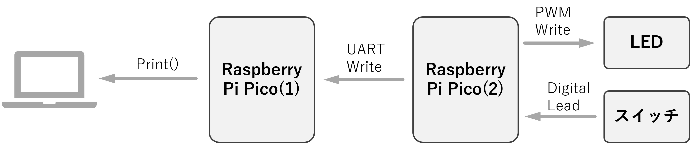

# ソフトウェアテストとハードウェアテスト

## 組み込みシステムにおけるテストとは何か
テストとは、製品があらかじめ定めた仕様や要件を満たしているか確認するプロセスです。組み込みシステムとは特定の機器に組み込まれたハードウェア＋ソフトウェアからなるシステムであり、家庭用電化製品から自動車、医療機器に至るまで幅広く使われています。そのため、万一バグ（不具合）が残ったまま製品化すると重大な問題を引き起こす可能性があるため、組み込み分野では高い信頼性を確保するテスト技術が重要となります。 組み込みシステムのテストでは、ソフトウェア面とハードウェア面の双方を考慮する必要があります。組み込みソフトウェアは特定のハードウェア上で動作するため、ハードウェアとのインターフェースや連携動作が正しいかまで確認しなければなりません。そのため、単にソフトウェア単体の動作検証だけでは不十分です。また、多くの組み込み機器ではリアルタイム性（所定時間内での処理完了）が求められるため、動作タイミングやパフォーマンスの検証も重要な要素になります。さらに製品によっては温度や振動など使用環境下で正常に動くかといった試験も必要です。要するに組み込みシステムのテストとは、ソフトウェアとハードウェアが一体となった製品全体が、あらゆる状況で期待通りに機能し続けることを保証するための取り組みです。

## システムズエンジニアリングにおけるテストの位置付け
大規模なシステム開発では、システムズエンジニアリングの考え方に沿って設計からテストまでを計画します。その代表的なモデルが「V字モデル（Vモデル）」です。


Vモデルでは、開発工程（左側）とテスト工程（右側）が対応付けられており、要件定義で決めた内容はシステムテストで確認し、**基本設計の内容は結合テストで確認**、詳細設計の内容は単体テストで確認する、といったように**段階ごとに対応するテストが設定されています**。これにより、それぞれの開発段階で作成した成果物（要件定義書、設計書、コードなど）が妥当に実装されているかを確実に検証できます。例えば、システムテストでは要求された機能や性能がシステム全体で満たされているか検証し、結合テストではモジュール間のインタフェースや連携が正しく動くかを確認します。こうした体系立てられたテスト計画により、**プロジェクト後半での大きな手戻りを減らし、効率的に品質保証を行うことができます**。


## ソフトウェアテストの基本と組み込み開発での役割

ソフトウェアテストには手法の違いとしてブラックボックステスト（外部から見たテスト）とホワイトボックステスト（内部構造を考慮したテスト）という分類もあります。

ブラックボックステストではプログラムの内部構造を意識せず、入力に対して期待通りの出力が得られるかという外部からの振る舞いに着目して機能を検証します。ユーザー視点でソフトウェアの機能や結果を確認するテストと言えます。

一方、ホワイトボックステストではソースコードやアルゴリズムといった内部まで踏み込んで検証を行い、コード上のロジックミスや抜け漏れを発見します。

例えば分岐の網羅性チェックやメモリ使用量の確認など、実装内部の観点からバグを洗い出すアプローチです。これら二つの視点を組み合わせることで、それぞれ単独では見逃しがちな欠陥も補完し合い、信頼性の高いソフトウェアにつなげることができます。

実際の開発では、単体テストではホワイトボックス手法で細部をテストし、結合テストやシステムテストではブラックボックス手法で外部仕様通り動くか確認する、といった使い分けがなされています。

テストで確認すべき内容は機能の正しさだけではありません。組み込みソフトウェアでは必要な性能や品質特性を満たしているかという非機能テストも重要です。例えばリアルタイム制御システムでは、決められた周期や時間内に処理が完了することを確認する性能テスト（タイミング検証）が欠かせません。

他にも、メモリ使用量や電力消費が許容範囲内か、異常時に安全にフェイルするか、といった観点もテストで確かめます。近年はセキュリティ上の脅威に備えるため、ネットワーク経由の不正アクセスに対する脆弱性テストを行うケースもあります。

組み込みソフトの開発現場では、ハードウェアが未完成でもソフトの検証を進めるためにシミュレータやエミュレータを活用することがあります。これら仮想的な実行環境を用いれば、実機が手元になくてもソフトウェアの動作をある程度再現でき、ネットワーク断やセンサ異常など様々な状況をシミュレーションしてテストすることが可能です。シミュレータ上でテストケースを多数試すことで、実機では再現が難しい異常系のバグも効率よく発見できます。ただし当然ながら仮想環境だけですべてを網羅できるわけではなく、最終的には開発ボードや製品の実機上でソフトが意図通り動作することを確認する必要があります。

ソフトウェアテストを効果的に進めるにはテストの自動化も有力な手段です。テストケースが大量にある場合、人手で一つ一つ確認するのは非現実的です。そこでスクリプトやテストフレームワークを使い自動実行することで、繰り返し実施する単体テストなどを高速かつ確実に消化できます。自動テストを導入すれば人的ミスのリスクを減らし、常に一貫した基準で検証できるというメリットも得られます。特にファームウェアの更新頻度が高い開発環境では、自動化により変更のたびに迅速な再テストが可能となり、結果としてリリースサイクルの短縮と品質向上に寄与します。


ブラックボックス
```py
# test_led_controller.py
from led_module import LEDController

led = LEDController(pin_no=15, duty_max=1000)  # 簡易化のためduty_max=1000
# 境界値テスト
for pct, expect in [(0,0), (50,500), (100,1000)]:
    led.set_brightness(pct)
    assert led._pwm.duty_u16() == expect, f"{pct}% → {led._pwm.duty_u16()}"
print("Unit tests passed.")

```

タイミング試験
```py
# test_performance.py
import time
from main import button, bright_led

t0 = time.ticks_us()
button._pin.value(0)
time.sleep(0.01)
# LEDController 内部で即座に set_brightness() が呼ばれると仮定
t1 = time_ticks_us()  # 実機ではピン変更からLED更新までの遅延測定
delta = t1 - t0
print(f"Response time: {delta}μs")
assert delta < 5000  # 5ms以内に制御できるか


```

## ハードウェアテストの基本と一般的なユースケース
ハードウェアのテストもソフトウェア同様に、開発段階と製造段階で目的が異なります。開発段階では試作したハード（基板や回路）が設計通り機能するか綿密に検証します。これは設計検証試験（Design Validation）と呼ばれ、製品設計の妥当性を確認するためのテストです。たとえば各回路ブロックが期待の電圧・電流で動作するか、センサーの精度が仕様を満たすか、温度や負荷など極端な条件下でも安定しているか、といった点を評価します。設計検証では製品の性能限界や安全マージンを把握するために、要求仕様を超える厳しい環境で試験を行うこともあります。こうしたテスト結果に基づき、必要に応じて部品の変更や回路設計の修正を加え、量産前に製品の完成度を高めていきます。 製造段階では、実際に生産された各ユニットごとに出荷前の検査を行います。これは量産試験またはエンドオブライン（EOL）テストとも呼ばれ、完成品が製品仕様を満たしているかを最終確認する機能テストです。

一般に製造ラインでは専用のテスト治具や計測装置を用い、人手を介さず自動的にテストが進むよう工夫されています。例えば基板上の各入出力端子にプローブを当て、一連のテストパターンを流して正しい応答が得られるか確認したり、製品に内蔵された自己診断機能を動作させて異常箇所がないか検査したりします。テスト時間は製造タクトに影響しないよう短く設計され、不良品を素早く検出・排除することに主眼が置かれます。こうして製造試験に合格した製品だけがユーザのもとへ出荷される仕組みです。 設計検証と量産試験では目的が異なります。量産試験が製品ごとの合否判定（要求を満たすかどうか）に重点を置くのに対し、設計検証では製品設計そのものの問題点を洗い出し改善することが目的です。

したがって設計検証では通常使用しない厳しい条件下での評価や長期耐久試験を行い、設計の弱点を探します。一方、量産時のテストは限られた時間内で主要機能に不具合がないかチェックする効率重視の試験になります。いずれも最終的には製品の品質保証というゴールは同じですが、こうした観点の違いによりテスト項目や手法が使い分けられています。 製品の信頼性を確保するための試験も欠かせません。信頼性を評価する信頼性試験では、製品や部品を長時間または繰り返し動作させ、経年劣化や繰り返しストレスによる故障が起きないか確認します。

例えば自動車の電装部品であれば何万回ものスイッチのオン・オフを繰り返す耐久試験や、機械的なアクチュエータであれば想定荷重をかけたまま何千回も動かす試験を行い、摩耗や破損が発生しないか観察します。

また一定時間ごとに高温・低温を交互に繰り返す温度サイクル試験や、振動台に載せて長時間の振動試験を行い、はんだ付けや部品固定部にクラックや緩みが生じないか確認することも一般的です。こうした過酷試験で初期故障や弱点を洗い出し、問題が見つかれば設計や部品の改善につなげます。

信頼性試験の結果から予想される製品寿命は、保証期間（例えば○年保証など）を設定する根拠にもなります。 さらに製品によって必要となる環境試験もあります。製品が実際に使用される環境（例えば高温多湿の屋外や振動のある車載環境、塵埃の多い工場内など）を想定し、その条件下で正常動作するかを試験します。具体的には、極端な高温・低温で性能が劣化しないか、湿度や水濡れによる誤動作や故障が起きないか、落下や衝撃に耐え得る堅牢性があるか、といった項目をチェックします。必要に応じて国際規格に準拠した試験が行われており、たとえば米国防総省のMIL-STD-810規格では温度、振動、衝撃など各種環境ストレスに対する試験方法が定められています。

環境試験に合格することで、製品が実使用環境でも所期の性能を発揮できるとの信頼性を裏付けられます。 なお製品分野によっては、法規制に対応した認証試験も必要です。たとえば無線通信機器であれば技術基準適合証明（技適）やFCC認証、情報機器であれば電波法やEMC（電磁両立性）試験、電気製品では安全基準（例：UL認証やCEマーキング）の取得が要求されます。

これら認証試験は認定された第三者試験機関で実施され、製品が各種法規的な基準を満たしていることを確認するものです。組み込み製品を市場に出す際には、こうした公式のハードウェア試験も計画に組み込む必要があります。
| 試験段階   | 目的                 | 主な項目                           |
| ------ | ------------------ | ------------------------------ |
| 設計検証試験 | 回路・部品が仕様通り動くか厳密に確認 | 電圧・電流測定、センサー精度、温度・負荷ストレス試験     |
| 量産試験   | 製造後ユニットごとの合否判定     | テスト治具＋自動パターン検査、自己診断機能による簡易チェック |


## ハードウェア・ソフトウェアの統合テスト
組み込みシステムでは最終的にハードウェア上でソフトウェアを動作させ、ハード・ソフト一体となったシステム全体をテストする必要があります。ソフト単独では問題なく見えても、実機上で初めて明らかになる不具合も少なくありません。例えばセンサー値の読み取りタイミングのずれによる制御不良や、ハードウェア割り込み競合による処理のタイミング問題、メモリや周辺デバイス資源の制約による予期せぬ動作など、ハードとソフトの境界で起こる問題です。したがって、ハードウェアとソフトウェアの統合テスト（システムテスト）では両者が正しく連携して動作することを確認する点が特に重視されます。実際、ソフトウェアとハードウェアが正しく相互作用しているかを確かめることこそ組み込みシステム特有の重要なテスト項目と言えます。

## テスト駆動開発 (TDD) の概念
テスト駆動開発（Test-Driven Development; TDD）は、テストを先に作成し、そのテストをパスするためにコードを書いていく開発手法です。

従来のウォーターフォール型開発（「設計→実装→テスト」の順）では、最後にまとめてテストを行っていました。これに対しTDDでは「テスト→実装→リファクタリング」のサイクルを小刻みに何度も回し、コードを書く前に期待する振る舞い（テストケース）を定義します。具体的には、まず 失敗するテスト を書き（Red）、次にそのテストが通る最小限の実装を行ってテストを パス させ（Green）、最後にコードの整理（リファクタリング）を行う、というステップを繰り返します。このように テストファースト で進めることで、開発者は要件を正確に把握し、不具合を早期に発見できます。また、必要最低限の実装から始めるためコードが過剰に複雑化しづらく、結果としてシンプルで保守しやすい設計が得られるというメリットがあります。

## 宇宙機・衛星開発におけるテストとTDDの親和性
宇宙機（人工衛星や探査機など）の開発では、テスト駆動開発の精神に通じる「とにかく早期に問題を炙り出す」姿勢が極めて重要です。宇宙機は一度打ち上げてしまうとハードウェアを交換・修理できない(**非修理系**)ため、ソフトウェアもハードウェアも事前に徹底的な検証が求められます。例えば、いきなり本番機を作るのではなく、ブレッドボードモデル (BBM：基本設計検証)、エンジニアリングモデル (EM：詳細設計検証)、プリフライトモデル (PFM：受入テスト検証) といった段階的な試験モデルを作成し、各種試験で設計の妥当性を検証してからフライトモデル（FM：実機）の製造に移行するのが一般的です。

宇宙開発のような大規模で手戻りが許されないプロジェクトはウォーターフォールモデルと言われますが，このプロセス自体は「テストを通じて設計を洗練させる」ものであり、TDDの考え方（フィードバックを早く得て修正を重ねること）と親和性が高いと言えます(筆者意見)。
また、宇宙機のソフトウェア開発でも可能な限り自動テストやシミュレーションを活用して不具合検出に努めます。打ち上げ後に見つかるバグは致命的なので、地上でのモデリング・シミュレーション試験（SILS: Software-In-the-LoopやHILS: Hardware-In-the-Loop試験）や、各種ユニットテスト・統合テストを通じて、想定外の動作を事前につぶしておくことが重視されます。TDDのようにテストから開発をスタートする手法は、宇宙開発分野でも信頼性向上のための有効な手段となっています。

## 演習課題: Raspberry Pi Picoを用いたテストと開発実践

以上の座学で学んだテスト手法の考え方を踏まえ、実際に簡単なハードウェア・ソフトウェア統合システムを開発しながらテストの重要性を体感してみましょう。演習では Raspberry Pi Pico (マイコンボード) を2台と、LEDおよびタクトスイッチ1個ずつを使用します。1台目の Pico にスイッチとLEDを接続し、2台目の Pico はUART通信で1台目から送られてくるデータをPCに表示する役割を担います。具体的な目標動作は以下のとおりです。



* **Pico #1（受信側）**: Pico #1からUARTで送られてきた明度データを受け取り、USB経由で接続されたPCに対して print()関数で「Brightness : {n}%」というメッセージを表示する（つまりPCのシリアルコンソール上に明るさを表示する）。
* **Pico #2（送信側）**: タクトスイッチが押されるたびに、接続されたLEDの明るさが「0% → 20% → 40% → 60% → 80% → 100% → 0% → ...」と段階的にループアップするように制御する。また、その時設定された明度値をUART通信でPico#1に送信する。

このシステム全体を通して、ハードウェア（LEDやボタン）とソフトウェア（コードやクラス設計）が連携し、さらにマイコン間通信によってデータがやり取りされる流れを作ります。以下、順を追って実装と確認の手順を示します。

1. **LED制御の確認**: まずはPico #1側でLEDを制御するコードを書き、LEDの明るさを任意に変えられることを確認しましょう。用意されている `LEDConteroller` クラス（PWM出力を用いてLEDのデューティ比を制御するクラス）を使います。例えば、`LEDConteroller`をGPIOピン25（PicoのオンボードLED）に対して初期化し、`set_brightness(20)`のように呼び出すとLEDが20%の明るさで点灯するはずです。さらに`blink(3, 0.5)`といったメソッドで点滅動作を試し、PWMによる明るさ制御や点灯・消灯が期待通り動くことを確認してください。ここでは、ハードウェア（LED）がソフトウェアから正しく駆動できるかをテストする工程と捉え、意図通りの明るさ変化が得られるか観察します。

2. **ボタン入力の利用**: 次に、タクトスイッチ（ボタン）をPico #1に接続し、Buttonクラスを用いてその入力を扱います。Buttonクラスは内部プルアップ/プルダウン抵抗を利用したボタン入力読み取りを簡単にするものです。たとえばボタンをGPIO2に接続し（片方をGPIO2、もう片方をGNDに接続）、`Button(2, pull='UP')`のように初期化すると、`is_pressed()`メソッドで押下状態をTrue/Falseで取得できます。Pico #1上でループを回し、ボタンが押されたことを検知したら先ほどのLEDの明るさを一段階上げて設定するコードを作成しましょう。明るさの値は0,20,...,100の6段階で管理し、100%まで到達したら次は0%に戻るようにします。このときデバウンス（機械的なチャタリング対策）として、ボタンが押されたら少し待ってから状態を確認したり、次にボタンが離されるまで待つ処理を入れると良いでしょう。ここまで実装できたら、実際にボタンを何度か押してLEDの明るさが段階的に変化することを目視でテストしてください。ハードウェア入力（ボタン）から出力（LED）までが正しく連動していれば成功です。

3. **UART通信の接続**: ここから2台目のPicoとの通信部分を実装します。まずハード的な接続として、Pico同士をUART通信でつなぎます。一般的にUARTはクロス接続にする必要があるため、Pico #1の送信ピン (TX) をPico #2の受信ピン (RX) に、Pico #1の受信ピンをPico #2の送信ピンに接続します。また両者のGNDピン同士も確実に接続してください。今回使用するUARTポートは両Picoとも UART0 を使い、ピン配置は TX=GP0, RX=GP1 を利用します（このピンはデフォルトでUART0に割り当てられています）。接続後、Pico #1側でUARTを初期化し（通信速度はボーレート`115200bps`を使用）、ボタンが押されてLED明度を更新するたびに、その明度値をUART経由で送信する処理を追加しましょう。送信データの内容はシンプルに明るさの数値（0〜100）でも構いませんし、文字列 `"Brightness: {n}%"` のような形式で送っても構いません。重要なのは、Pico #2が受け取って理解できる形式であることと、送信タイミングがボタン押下のたびであることです。実装後は、UARTの送信動作をテストします。Pico #1単体をPCに繋ぎ、UART送信部分をデバッグ用に一旦`print()で`表示させるか、あるいはロジックアナライザやシリアルコンソールを用いて送信されているデータを確認できると理想的です。

4. **`UARTPrint`クラスの実装と受信テスト**: 続いてPico #2側の受信処理を構築します。新たに作成する UARTPrint クラス は、受信側PicoでUARTからデータを読み取り、そのまま標準のprint()関数でPCに表示するためのユーティリティです。Pico #2ではこのUARTPrintクラスを使ってUART受信をポーリングし、データが来たら自動でprint()するように動作させます。クラスにはUARTポート番号（今回は0）、使用ピン（`TX=GP0, RX=GP1`）、ボーレート（`115200bps`）を指定して初期化するコンストラクタや、通信速度を変更するためのメソッド（必要に応じて）などを用意しましょう。また、受信を処理するメソッドでは、例えば`uart.readline()`等で1行分のデータを取得し、それをデコードしてからprint()で出力すると簡単です。演習のヒントとして、MicroPythonでは machine.UART クラスでUARTを扱えます。受信データがテキストとして送られてくる場合は .readline() や .read() を使い、バイナリの場合は適宜パースする必要があります。今回は明度という単純な数値/文字列ですので難しく考えすぎなくても大丈夫です。 UARTPrintクラスの実装ができたら、Pico #2上でそれを動かしてみます。PCにUSB接続したPico #2のシリアルコンソール（例えばPuTTYやTera Term、ThonnyのREPLなど）を開き、Pico #2のプログラムを実行してください。Pico #1側の送信プログラムも動作させ、両方のPicoを正しく配線してリセットします。すると、Pico #1でボタンを押すたびに、Pico #2側のコンソール画面に Brightness : X% というメッセージが表示されるはずです。例えば最初に押したとき「Brightness : 20%」と表示され、以降押すごとに数値が増えていき、100%の次は0%に戻る表示になります。このように、人間の目で結果を確認するテストによって、マイコン間通信と出力処理が期待通り連動していることを検証します。

5. 発展的なポイント (必要に応じて): 時間に余裕があれば、いくつか追加で確認・発展させてみましょう。たとえば、UARTの通信速度を変えてみて正しく動くか（UARTPrintの設定を変更）、あるいはボタンのon_press()メソッド（割り込みハンドラ登録）を使って実装してみて、ポーリングとの挙動の違いを観察する、といったことも考えられます。また、LEDの明るさ制御において、与えたパーセンテージが正しくデューティ比に反映されているかを計算で確認したり、実際のLEDの輝度がリニアに変化して見えるかどうか（人間の目の感じ方との違い）なども興味深い点です。これらはソフト・ハードの両面でテスト設計を行う際に考慮すべきポイントであり、演習を通じてぜひ試してみてください。

### サンプルコード
```py
# main_receive.py (受信側 Pico #1 用)
from time import sleep
from uart_print_module import UARTPrint

# 受信側UARTPrintインスタンスの初期化（UART0, TX=GP0, RX=GP1, 115200bps）
uart_printer = UARTPrint(uart_id=0, tx_pin=0, rx_pin=1, baud=115200)

print("Receive-side Pico is running. Waiting for data...")

# 永久ループでUARTデータ受信を監視し、あればプリント
while True:
    uart_printer.read_and_print()
    sleep(0.05)  # 少し待機（50ms間隔ポーリング）
```

```py
# main_receive.py (送信側 Pico #2 用)
"""
main.py – 基本 I/O 演習デモ（送信側）
-------------------------------------------------
* ボタンを押すたびに外付け LED の明るさを
  0 → 20 → … → 100 → 0 % で循環
* 変化を UART(115200 bps) に出力
* 現在レベル+1 回、オンボード LED を点滅してフィードバック
対象: Raspberry Pi Pico (MicroPython v1.22 以降)
"""

import time
from led_module import LEDController
from button_module import Button
from serial_print_module import SerialPrint

# ─── ハード初期化 ─────────────────────────────
STATUS_LED_PIN  = 25   # オンボード LED
BRIGHT_LED_PIN  = 15   # 外付け LED
BUTTON_PIN      = 14   # タクトスイッチ
BAUDRATE        = 115200
STEP_PERCENT    = 20   # 1 段あたり 20 %

status_led   = LEDController(pin_no=STATUS_LED_PIN)
bright_led   = LEDController(pin_no=BRIGHT_LED_PIN)
button       = Button(pin_no=BUTTON_PIN, pull='UP')
uart_printer = SerialPrint(baud=BAUDRATE)

brightness_level = 0  # 0〜5 を循環（×20% で 0〜100%）

# ─── メインループ ────────────────────────────
while True:
    if button.is_pressed():
        # 1) レベル更新
        brightness_level = (brightness_level + 1) % 6
        percent = brightness_level * STEP_PERCENT

        # 2) LED デューティ変更
        bright_led.set_brightness(percent)

        # 3) UART へ送信
        uart_printer.print(f"Brightness : {percent}%")

        # 4) 状態フィードバック（オンボード LED 点滅）
        status_led.blink(times=brightness_level + 1, interval=0.2)

        # 押しっぱなし＋チャタリング対策
        while button.is_pressed():
            time.sleep(0.02)

    # ポーリング周期：約 10 ms
    time.sleep(0.01)
```

```py
# serial_print_module.py
# ---------------------------------------------------------
# UART0 (TX=GP0, RX=GP1) で print 互換の送信を行うユーティリティ
# デフォルト 115200 bps。baud を変更したい場合は set_baudrate() を呼ぶ。
# ---------------------------------------------------------
from machine import Pin, UART

class SerialPrint:
    def __init__(self,
                 uart_id: int = 0,
                 tx_pin: int = 0,
                 rx_pin: int = 1,
                 baud: int = 115200) -> None:
        self._uart = UART(uart_id,
                          baudrate=baud,
                          tx=Pin(tx_pin),
                          rx=Pin(rx_pin))
        self._baud = baud

    # ── 基本 API ──────────────────────────────
    def print(self, *args, sep: str = " ", end: str = "\n") -> None:
        """通常の print と同じ書式で UART へ送信する。"""
        msg = sep.join(str(a) for a in args) + end
        self._uart.write(msg)

    # ── 便利関数 ──────────────────────────────
    def set_baudrate(self, baud: int) -> None:
        """ボーレートを動的に変更する。"""
        self._baud = baud
        self._uart.init(baudrate=baud)

    @property
    def baudrate(self) -> int:
        return self._baud
```

```py
# uart_print_module.py
from machine import Pin, UART

class UARTPrint:
    def __init__(self, uart_id: int = 0, tx_pin: int = 0, rx_pin: int = 1, baud: int = 115200) -> None:
        """UARTを用いた受信・プリントクラスを初期化。uart_idポートをbaud[bps]で開き、指定TX/RXピンを使用。"""
        # UARTポートを初期化（TXも指定するが受信側ではTXは使わない）
        self._uart = UART(uart_id, baudrate=baud, tx=Pin(tx_pin), rx=Pin(rx_pin))
        self._baud = baud

    def set_baudrate(self, baud: int) -> None:
        """UART通信速度（ボーレート）を変更する。"""
        self._baud = baud
        self._uart.init(baudrate=baud)

    def read_and_print(self) -> None:
        """UART受信バッファをチェックし、データがあれば読み取って表示する。"""
        if self._uart.any():  # 受信データがあるか？
            data = self._uart.readline()
            if data:
                try:
                    # テキストデータを想定しデコードして表示
                    text = data.decode('utf-8').rstrip('\r\n')
                    print(text)
                except Exception:
                    # 万一テキストでなければそのまま表示
                    print(data)

```

以上の手順で演習課題を進めることで、**ソフトウェアテスト（プログラムの論理検証）とハードウェアテスト（物理デバイスの挙動確認）**の両方を実践することになります。小規模なシステムではありますが、単体部品のテスト→統合テスト→システムテストという流れを疑似体験し、さらにテストを先行させて開発を進めることの有効性も感じ取ってもらえればと思います。
