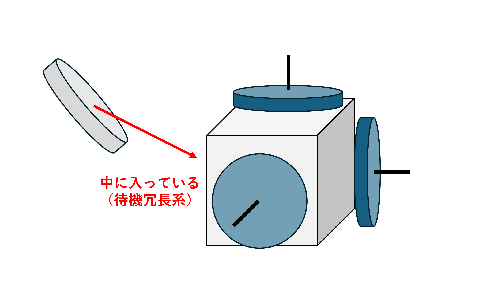
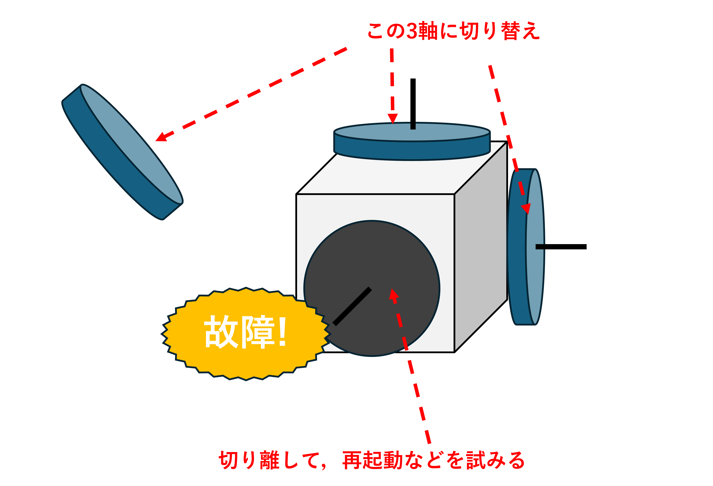

# エラーハンドリングとFDIR

人工衛星は，自動車や船舶，飛行機のような地上の組込みシステムと違って，一度出荷(引き渡し・運用)されるともう二度と修理できません（非修理系）．
そのくせ，開発には長い期間と莫大なコストがかかるため，「予期しないエラーのせいで処理落ちしちゃった」なんてことが許されないシビアな世界です．
そこで，エンジニアは衛星がそもそも行いたい予定通りの動作(ノミナル動作)だけでなく，エラーが発生することを見越した設計が必要です．
今回は，エラーを見越した設計とはどのような設計なのかを学んでいきましょう．


## エラーハンドリングとは

エラーハンドリングとは，<u>**プログラム実行時にエラーが発生した場合に，そのエラーを検出し，適切な処理を行う仕組みのことです．**</u>

これにより，プログラムの予期せぬ停止を防ぎ，エラー発生時にもシステムを安定して動作させることが出来ます．

地上のシステムでは，よく次のようなステップが踏まれます．

> 1. エラーを検出する
> 2. エラーの内容を記録する
> 3. メールなどで管理者に通知する
> 4. 処理を終了して，エンジニアの対応を待つ

しかし，人工衛星のようなエンジニアが直接，故障の要因を確認できないようなシステムでは，システムが自分自身をモニタリングして，エラーを検出し，必要に応じてエラー箇所をシステムから切り離したり，再起動するという判断を行う必要があります．この考え方をFDIRと言います．
FDIRについては，記事の後半で詳しく触れていこうと思います．

まずは，一般的なソフトウェアで実施されるエラーハンドリングについて説明していきます．


## エラーの種類

エラーの種類は，プログラミング言語の公式ドキュメントなどを見ると，明確に記述されています．例として，[Pythonの公式ドキュメント](https://docs.python.org/ja/3/tutorial/errors.html)を見てみましょう．

> エラーには (少なくとも) 二つのはっきり異なる種類があります。それは 構文エラー (syntax error) と 例外 (exception) です。
>
> ...
>
> 実行中に検出されたエラーは 例外 (exception) と呼ばれ、常に致命的とは限りません。
>

構文エラー(Synta error)はプログラミング作成時に見つけられるのであまり大事に至ることは無いですが，実行中に現れるエラーである「<u>**例外(Exeption)**</u>」について扱っていきます．

この例外処理はテスト時に一度パスしただけで，安心してはいけません．
プログラムは実行されていく中で参照状況がどんどん変化していきます．
テストケースの実行時には上手く参照できていたファイルが，本番環境では別なプログラムから操作されており想定していない状態になっていた...など，想定していない挙動をしたときに例外は発生します．

皆さんも，Pythonの実行時に次のような画面を見たことがあるのではないでしょうか．

```bash
l = 100
l.append(200)

# Traceback (most recent call last):
#   File "/Users/mbp/Documents/my-project/python-snippets/errors.py", line 2, in <module>
#     l.append(200)
# AttributeError: 'int' object has no attribute 'append'
```

ここでは，`AttributeError`が発生しているようです．
このように，プログラムを実行している際にエラーが発生して止まることがあります．

まずは，これらのエラーのうち例を一つ見てみましょう．
```py
print(float('float number'))
# ValueError: could not convert string to float: 'float number'

print(float('1.23E-3'))
# 0.00123
```
この事例では，文字列型`float number`をfloat型に変換してprintしようとした結果，変換可能なデータではなかったため，`ValueError`が出ています．

実際の組込みシステムでも，数値データが格納されているはずのデータが通信の過程でノイズが乗り，想定していないデータ型になってしまう可能性があります．

こういったケースが発生したときにプログラムが停止しないようにエラーハンドリングが必要です．

他にも，エラーの種類を知っていきましょう．

| 例外名                 | 発生原因 (典型)       | コード例                     | 対策                            |
| ------------------- | --------------- | ------------------------------ | -------------------------------- |
| `IndexError`        | リストやタプルの範囲外アクセス | `python lst = [1, 2]; lst[3]`  | 範囲チェック `if 0 <= i < len(lst): …` |
| `KeyError`          | dict に存在しないキー参照 | `python d = {}; d["id"]`       | `dict.get(key, default)` でデフォルト値 |
| `TypeError`         | サポート外の型演算       | `python 1 + "a"`               | 実行前に `isinstance` で型確認           |
| `ValueError`        | 値域不正・型は正しい      | `python int("abc")`            | try–except で再入力促し                |
| `AttributeError`    | オブジェクトに属性が無い    | `python n = 3; n.append(4)`    | API 仕様確認・`hasattr` で検査           |
| `ZeroDivisionError` | 0 除算            | `python 1 / 0`                 | 分母ゼロ判定し回避                        |
| `FileNotFoundError` | 存在しないファイルオープン   | `python open("missing.txt")`   | `Path.exists()` で事前確認            |
| `TimeoutError`      | I/O や通信のタイムアウト  | *擬似例* `socket.recv(timeout=1)` | リトライ・バックオフ                       |
| `MemoryError`       | メモリ枯渇           | `python a = [0]*10**9`         | 分割処理・ストリーム化・ガベコレ                 |
| `RuntimeError`      | 内部状態の矛盾等        | *例* `threading` 同期違反           | 状態遷移の不変条件を設計文書化                  |


## エラーハンドリングの実装

ソフトウェア的に実現するエラーハンドリングは，<u>**「例外処理」**</u>と呼ばれる仕組みを用いて実現されます．そのPythonにおける実装方法を紹介します．

pythonで例外処理を行うには，`try-except`文を使います．

まず，実行したい内容を`try`以下のインデントに入れます．
そのあと，`except`を用いて，例外処理を別なインデントに書いていきます．

```py
try:
    # 例外が発生しうる処理
    risky_operation()
except {エラーの種類} as e:
    # そのエラーが起きたときに行う処理
    handle(e)
```

たとえば，普段実行するプログラムをすべてtryの中に入れて，何かしらのエラーが発生したらコンピュータを再起動するプログラムにしたら，絶対にプログラムは停止しません．

（...が，ミスをすると，エラー発生と再起動を永遠に繰り返すゾンビになりかねないのでこの実装は注意）


except以下には色々な例外を指定して例外ごとに異なった処理が出来るので，出来るだけ明示的に「この例外が発生したらこの処理を行う」と分岐させて書くことが大切です．

`except Exception as e`で，全ての例外をキャッチすることもできます．

```py
try:
    # 例外が発生しうる処理
    risky_operation()
except SpecificError as e:
    # そのエラーが起きたときに行う処理
    handle(e)
except (ValueError, ZeroDivisionError) as e:
    # ValueError または ZeroDivisionError のどちらかが発生した場合
    print(f"エラーが発生しました: {e}")
    # フォールバック処理や再入力の促しなど
except Exception as e:
    # 予期しない例外をすべてキャッチ
    # 最終手段を書く もしくは
    raise  # 例外を上位に再スローして適切なハンドリングに委ねる
else:
    # except が一度も走らなかった場合だけ実行
    post_success()
finally:
    # 例外の有無にかかわらず必ず実行（リソース解放など）
    cleanup()
```

## 例外処理実装ガイドライン
以下に，例外処理を実装する際のガイドラインを付しておくので，今後の開発で立ち返って参照してください．
> 1. 具体的な例外を捕捉し，Exception は最後の砦
> 2. 詳細なロギング(ログの出力)で再現性を確保
> 3. 復旧 or 安全停止方針をコードで一貫
> 4. finally / with でリソースリーク防止
> 5. ユニット試験＋フェイルシナリオ試験を両輪で

## 演習1 | 例外処理の実装

ここで，Pythonで実現する例外処理の問題を2題出題します．
仕様を与えるので，その使用に従ってプログラムを作成してください．
---
---

### 仕様

標準入力から数値 `a` (分子) と `b` (分母) を読み取り、商 `a` / `b` を表示するプログラムを作成せよ。

ただし次の要件を満たすこと。

- **ValueError**（数値以外が入力された）の場合は
「数値を入力してください」と表示して再入力を促す。
- **ZeroDivisionError**（分母が 0）の場合は
「0では割れません」と表示して再入力を促す。

正常に計算できたら結果を表示し、プログラムを終了する。

> ヒント
>
> `x = input()`というプログラムを書くことで，
> キーボードで値を入力してxに代入するプログラムが書ける．
>
> `x = input('Hello:')`とすれば，ターミナルで`Hello:`と出力されて入力待ちになる
> （`Hello`の部分はどんな文字列でもいい）

#### 想定される挙動
```bash
a? five
数値を入力してください
a? 10
b? 0
0では割れません
b? 2
結果: 5.0
```
#### 解答例は[こちら](./00-サンプルコード/07-error/test.py)

---
---

## FDIRとは

FDIR（Fault Detection, Isolation, and Recovery）とは、システムや機器の故障を検知、特定、復旧する機能のことです。
主に、人工衛星や産業機械などの複雑なシステムで、故障が発生した際に自動で対応するために用いられます。

FDIRの主な目的は、故障によるシステム停止や性能低下を防ぎ、システムの信頼性と安全性を高めることです。

具体的には、以下の3つの段階で構成されます。
- **故障検知（Fault Detection）**:センサーからのデータなどを監視し、異常を検知します。
- **故障分離（Fault Isolation）**:故障が発生した箇所を特定し，切り離します。
- **故障復旧（Recovery）**:故障した箇所を切り離したり、冗長系に切り替えたりして、システムの復旧を試みます。

## 事例
人工衛星の中でも，高精度な姿勢制御が求められる大型衛星だと，3軸のリアクションホイールを搭載して姿勢制御を行います．
そして，3軸姿勢制御を行う衛星は，どれか一つのリアクションホイールが壊れてもいいように，3軸のどの軸にも直交しない軸を取った，待機のリアクションホイールを搭載しています．


しかし，アクチュエータなど機械的な動作をする部品は摩耗や振動などによって，電気的な部品より寿命が短いことが多く，故障する可能性があります．

また，電力も多く消費するので，ショートして余分な電力が消費されていないかなど，厳密にチェックされます．

その結果，どれかのリアクションホイールが故障していることが分かると，そのホイールをシステムから切り離し，待機していたリアクションホイールを作動させます．

これにより，システムの機能は復帰します．


## 演習2
### 1 Hz Ping 監視による LED 点灯制御

1. 目的
UART 通信の周期送信／受信監視 を実装し、組込みソフトでよく使う「ウォッチドッグ的ロジック」を体験する。

タクトスイッチ入力で送信停止、LED 消灯で通信断を可視化することで、システム状態のフィードバック設計を学ぶ。

2. ハードウェア構成

| 役割         | デバイス | GPIO                                                     | 機能                                           |
| ---------- | ---- | -------------------------------------------------------- | -------------------------------------------- |
| **Pico-A** | 送信側  | GP14 : タクトスイッチ (IN, PULL\_UP)<br>GP0 **TX** / GP1 **RX** | 1 Hz で **`"PING\n"`** を送信<br>スイッチ押下中は送信停止    |
| **Pico-B** | 受信側  | GP25 : オンボード LED (OUT)<br>GP0 **RX** / GP1 **TX**        | **`"PING"`** 受信中は LED 点灯<br>5 s 受信なしで LED 消灯 |


## 参考文献
* https://www.cybermatrix.co/post/error-handling
* https://wa3.i-3-i.info/word1424.html?piyotype=etc